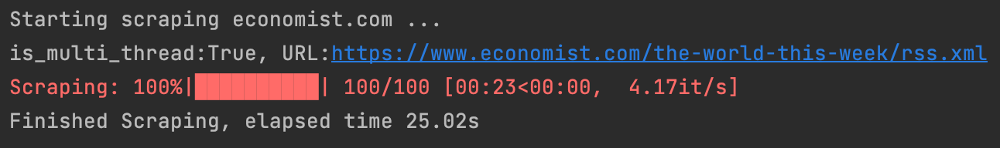
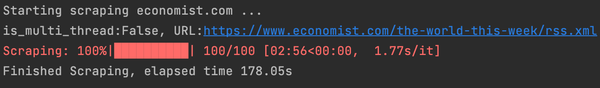

<h2>
Web Scraper
</h2>

This is an implementation of a tool designed to scrape the content of the latest news articles from The Economist
website.

<h2>Challenges, Difficulties and Roadmap</h2>
<ol>
<li>
First of all, I examined the website's structure to gain a comprehensive understanding of its layout. Upon realizing that scraping the website using HTML tags could be time-consuming and inefficient, particularly due to potential changes over time, I opted to explore alternative approaches. My objective was to locate a suitable API that would enable me to fetch and parse the desired data. Fortunately, I discovered that The Economist provides an <a href="https://www.economist.com/rss">RSS</a> feed that I could utilize. Consequently, I focused my efforts on parsing the RSS feed to extract the latest news section, which proved to be a more reliable and efficient method.
</li>
 
<li>
Secondly, I selected "<a href="https://www.economist.com/the-world-this-week/rss.xml">The World This Week</a>" section as the source for the latest news.
</li>
 
<li>
In the next phase, I came across an XML parser called <a href="https://pydantic-xml.readthedocs.io/en/latest/index.html">pydantic-xml</a>, which offers support for the lxml backend (it has a better performance because it is written in C). This parser allows for the seamless deserialization of XML data into Python objects.
</li>
 
<li>
I encountered another challenge when working with XML files, specifically the issue of handling empty fields such as <b>description</b>. To address this, I had to utilize the Union data type. Surprisingly, the documentation of pydantic-xml failed to provide any information or guidance on this matter.
</li>
 
<li>
In order to prevent duplication within my data structure, I opted to utilize the <b>set</b> data structure. This decision required me to implement the <code>__eq__</code> and <code>__hash__</code> functions within the Item schema class. By doing so, I was able to ensure proper comparison and hashing functionality for the set.
</li>
 
<li>
I added support for multithreading to improve the performance of the scraping process. Since scraping is an I/O bound task, using a single thread can result in slow execution. By utilizing multithreading, I was able to observe significant improvements in the results section.
</li>
</ol>

<h2> Installation </h2>
<ul>
	<li> Install requirements: 
		<ol type="a">
			<li> Install <b> "python >= 3.8" </b> </li>
			<li>  Install <b> "virtualenv" </b>
        			<pre><code>pip install virtualenv</code></pre> 
			</li>
			<li>
        			Create the virtual environment using following command:
        			<pre><code>virtualenv .env</code></pre>
    			</li>
			<li> Active virtualenv:
				<ul>
					<li> For linux: 
       						<pre><code>source .env/bin/activate</code></pre>
					</li>
					<li> For windows:
       						<pre><code>.\.env\Scripts\activate</code></pre>
					</li>					
				</ul>	
    			</li>
			<li> Now you can install libraries and dependencies listed in requirements file:
        			<pre><code>pip install -r ./requirements.txt</code></pre>
            </li>
            <li>
                You can exit from virtual environment using following command:
                <pre><code>deactivate</code></pre>
            </li>
		</ol>
	</li>
</ul>

<h2> Run </h2>
In order to run the application just run the following command :
<pre><code>python app.py</code></pre>

<h2> Results </h2>
As mentioned previously, with multithreading the performance increased significantly.
<h3>Multi Thread</h3>

  

<h3>Single Thread</h3>

  

